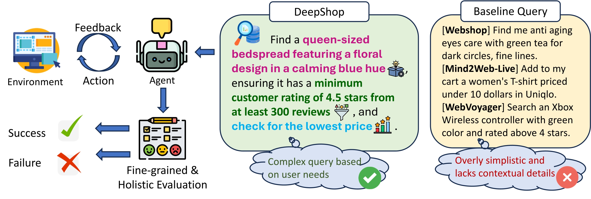
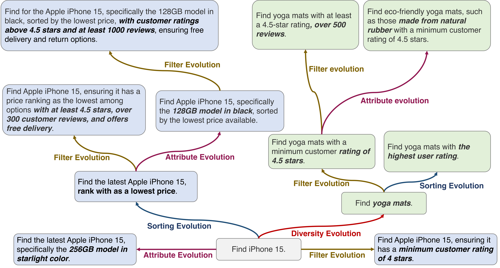

# **DeepShop: A Benchmark for Deep Research Shopping Agents**

[](https://www.python.org/downloads/)
[](LICENSE)



## 📋 Table of Contents

- [Abstract](#abstract)
- [Features](#features)
- [Project Structure](#project-structure)
- [Installation](#installation)
- [Quick Start](#quick-start)
- [Data Format](#data-format)
- [Shopping Query Evolution](#shopping-query-evolution)
- [Fine-grained and Holistic Evaluation](#fine-grained-and-holistic-evaluation)
- [Evaluation Metrics](#evaluation-metrics)
- [Results](#results)
- [API Configuration](#api-configuration)
- [Citation](#citation)

## Abstract

Web agents for online shopping have shown great promise in automating user interactions across e-commerce platforms. Benchmarks for assessing such agents do not reflect the complexity of real-world shopping scenarios, as they often consist of overly simple queries with deterministic paths, such as "Find iPhone 15." Real shopping scenarios are inherently more layered, involving multi-dimensional product attributes, search filters, and user-specific sorting preferences. 

To address this gap, we introduce **DeepShop**, a benchmark designed to evaluate web agents in complex and realistic online shopping environments. DeepShop comprises three key components:

1. **Query diversity evolution**: Starting from real user queries, we generate diverse queries across five popular online shopping domains.
2. **Query complexity evolution**: We further evolve these queries to increase complexity, considering product attributes, search filters, and sorting preferences, and classify them into three levels: easy, medium, and hard, based on the number of evolutions.
3. **Fine-grained and holistic evaluation**: We propose an automated evaluation framework that assesses agent performance in terms of fine-grained aspects (product attributes, search filters, and sorting preferences) and reports the overall success rate through holistic evaluation.

We conduct a systematic evaluation of retrieval-augmented generation (RAG) methods, web agents, and deep research systems. Results show that RAG struggles with complex queries due to its lack of web interaction, while other methods face significant challenges with filters and sorting preferences, leading to low overall success rates. We also perform cross-category, complexity-based evaluations and error analyses to support the advancement of deep research shopping agents.

## Features

- 🛒 **Multi-domain Coverage**: Supports 5 popular shopping categories (Books, Electronics, Home, Fashion, Sports)
- 🔄 **Query Evolution Pipeline**: Two-stage evolution process for realistic and complex shopping scenarios
- 📊 **Fine-grained Evaluation**: Automated assessment across product attributes, filters, and sorting preferences
- 🎯 **Difficulty Levels**: Queries classified into easy, medium, and hard based on complexity
- 🤖 **Agent Benchmarking**: Comprehensive evaluation framework for web agents and RAG systems
- 📈 **Holistic Assessment**: Overall success rate evaluation with detailed error analysis

## Project Structure

```
DeepShop-main/
├── assets/                          # Project images and diagrams
│   ├── evolution.jpg               # Query evolution pipeline diagram
│   └── framework.jpg               # Overall framework diagram
├── data/                           # Dataset files
│   ├── deepshop_evol_600_subquery.jsonl    # Subquery breakdown data
│   ├── deepshop_evol_600.jsonl             # Main evolved dataset
│   ├── deepshop_example.jsonl              # Example queries
│   ├── deepshop_filter_150.jsonl           # Filtered dataset
│   └── shopping_seed.jsonl                 # Seed queries
├── results/                        # Evaluation results and examples
│   └── example/                    # Sample evaluation results
│       ├── taskAmazon--100/        # Individual task results
│       ├── taskAmazon--104/
│       └── ...                     # More task directories
├── scripts/                        # Execution scripts
│   ├── run_data_evolution.sh       # Data evolution pipeline
│   └── run_evaluation.sh           # Evaluation pipeline
├── src/                           # Source code
│   ├── data_process/              # Data processing modules
│   │   ├── break_subquery.py      # Subquery decomposition
│   │   ├── complex_evolution.py   # Complexity evolution
│   │   ├── diverse_evolution.py   # Diversity evolution
│   │   ├── filter_data.py         # Data filtering
│   │   ├── openai_access.py       # OpenAI API integration
│   │   └── query_evolution.py     # Main evolution pipeline
│   └── evaluation/                # Evaluation modules
│       ├── auto_eval_attribute.py # Attribute evaluation
│       ├── auto_eval_filter.py    # Filter evaluation
│       ├── auto_eval_sort.py      # Sorting evaluation
│       └── strict_rule_eval_overall.py  # Overall evaluation
├── requirements.txt               # Python dependencies
└── README.md                     # This file
```

## Installation

### Prerequisites

- Python 3.8 or higher
- OpenAI API key (for query evolution and evaluation)

### Setup

1. **Clone the repository**:

   ```bash
   git clone <repository-url>
   cd DeepShop-main
   ```

2. **Install dependencies**:

   ```bash
   pip install -r requirements.txt
   ```

3. **Configure API credentials**:
   Create a `.env` file in the project root with your OpenAI API configuration:

   ```bash
   # .env file
   OPENAI_API_KEY=your_api_key_here
   OPENAI_BASE_URL=your_base_url_here  # Optional, for custom endpoints
   ```

## Quick Start

### 1. Run Data Evolution Pipeline

Generate diverse and complex shopping queries:

```bash
sh ./scripts/run_data_evolution.sh
```

This will execute:

- Query evolution across domains
- Subquery decomposition
- Data filtering and processing

### 2. Run Evaluation Pipeline

Evaluate agent performance on the generated queries:

```bash
sh ./scripts/run_evaluation.sh
```

This will execute:

- Attribute-based evaluation
- Filter-based evaluation
- Sorting preference evaluation
- Overall success rate calculation

## Data Format

### Query Structure

Each query in the dataset follows this JSON structure:

```json
{
  "web_name": "Amazon",
  "id": "Amazon--14",
  "ques": "Find the new surge protector on Amazon with 6 to 8 outlets under 25 dollars with customer reviews above 4+ stars.",
  "web": "https://www.amazon.com/?language=en_US&currency=USD",
  "attribute": "New surge protector with 6 to 8 outlets under 25 dollars",
  "filter": "Surge protector with customer reviews above 4+ stars",
  "sort": "None",
  "category": "Electronics",
  "difficulty": "easy"
}
```

### Field Descriptions

- **web_name**: Target e-commerce platform
- **id**: Unique query identifier
- **ques**: Full query text
- **web**: Target website URL
- **attribute**: Product attribute requirements
- **filter**: Search filter requirements
- **sort**: Sorting preference requirements
- **category**: Product category
- **difficulty**: Query difficulty level (easy/medium/hard)

## Shopping Query Evolution



The query evolution pipeline in *DeepShop* is designed to simulate realistic and increasingly complex online shopping behaviors through a two-stage process: **query diversity evolution** and **query complexity evolution**.

### Stage 1: Query Diversity Evolution

- Starts with 50 real-world seed queries from existing benchmarks (Mind2Web-Live and WebVoyager)
- Expands using GPT-4o to cover five popular product categories: Books, Electronics, Home, Fashion, and Sports
- Each seed query is rewritten to target a different domain, creating a balanced and representative dataset

### Stage 2: Query Complexity Evolution

Each diversified query is progressively enhanced across three dimensions:

- **Product attributes** (e.g., brand, color, size)
- **Search filters** (e.g., rating thresholds, shipping policies)
- **Sorting preferences** (e.g., lowest price, highest rating)

Enhancements are applied iteratively in five rounds, with one dimension randomly selected in each iteration, resulting in queries of varying difficulty levels.

### Execution

```bash
sh ./scripts/run_data_evolution.sh
```

## Fine-grained and Holistic Evaluation

The evaluation pipeline comprehensively assesses web agents' ability to handle complex online shopping tasks through a two-stage protocol:

### Stage 1: Fine-grained Evaluation

Each query is decomposed into three subcomponents:

- **Product attributes**
- **Search filters** 
- **Sorting preferences**

Using GPT-4o, each agent's result is automatically assessed against these subqueries by comparing the agent's final outputs and screenshots with the specified requirements, with binary labels ("Success" or "Not Success") assigned for each subgoal.

### Stage 2: Holistic Task Success Evaluation

The system checks whether all applicable subcomponents are satisfied. A query is marked as successful only if the agent correctly fulfills all explicitly stated requirements; omitted components are treated as automatically satisfied.

### Execution

```bash
sh ./scripts/run_evaluation.sh
```

**Note**: We have provided examples in the `results/example/` folder to make it easier to run the evaluation.

## Evaluation Metrics

### Fine-grained Metrics

1. **Attribute Success Rate**: Percentage of correctly identified product attributes
2. **Filter Success Rate**: Percentage of correctly applied search filters
3. **Sort Success Rate**: Percentage of correctly implemented sorting preferences

### Holistic Metrics

1. **Overall Success Rate**: Percentage of queries where all requirements are met
2. **Category-wise Performance**: Success rates across different product categories
3. **Difficulty-wise Performance**: Success rates across easy/medium/hard queries

### Cross-category Analysis

- Performance comparison across Books, Electronics, Home, Fashion, and Sports
- Domain-specific challenges and capabilities assessment

## Results

The evaluation results are stored in the `results/` directory, organized by task ID. Each task directory contains:

- `agent.log`: Detailed execution log
- `interact_messages.json`: Agent interaction messages
- `screenshot*.png`: Screenshots of agent actions
- Evaluation metrics and scores

### Example Results

Sample results are available in `results/example/` showing:

- Task execution flow
- Screenshot sequences
- Evaluation outputs
- Performance metrics

## API Configuration

### OpenAI API Setup

1. **Get API Key**: Obtain your OpenAI API key from [OpenAI Platform](https://platform.openai.com/)

2. **Environment Variables**: Set up your `.env` file:

   ```bash
   OPENAI_API_KEY=sk-your-api-key-here
   OPENAI_BASE_URL=https://api.openai.com/v1  # Optional
   ```

### Custom API Endpoints

If using custom API endpoints (e.g., Azure OpenAI), configure the base URL in your `.env` file:

```bash
OPENAI_BASE_URL=https://your-resource.openai.azure.com/openai/deployments/your-deployment
```

## License

This project is licensed under the MIT License.

## Acknowledgments

- Built upon existing benchmarks: Mind2Web-Live and WebVoyager
- Powered by OpenAI GPT-4o for query evolution and evaluation
- Community contributions and feedback

---

## Citation

If you use DeepShop in your research, please cite our paper:

```bibtex
@article{lyu2025deepshop,
  title={DeepShop: A Benchmark for Deep Research Shopping Agents},
  author={Lyu, Yougang and Zhang, Xiaoyu and Yan, Lingyong and de Rijke, Maarten and Ren, Zhaochun and Chen, Xiuying},
  journal={arXiv preprint arXiv:2506.02839},
  year={2025}
}
```

**Note**: This benchmark is designed for research purposes. Please ensure compliance with e-commerce platforms' terms of service when using web agents for evaluation.
